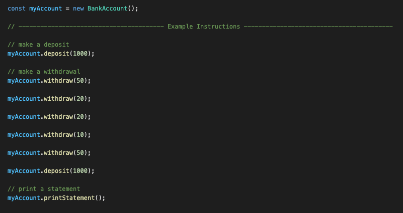
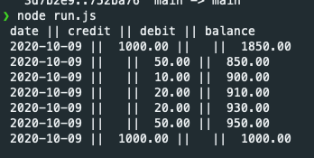

### Bank Tech Test in Javascript

#### For this tech test I will be rebuilding the previous bank tech test I did in Ruby, except this time in Javascript.
#### I am also seeking to streamline the functionality slightly.

### Instructions For Project Setup

$ npm install --save-dev jasmine   
$ npx jasmine init

### To Run the Tests

$ npm test

### To Try the Application

Type instructions into ./run.js

$ node run.js


### The Brief

Given a client:
* makes a deposit of 1000 on 10-01-2012
* And a deposit of 2000 on 13-01-2012
* And a withdrawal of 500 on 14-01-2012
* prints her bank statement
Then she would see:

```
date || credit || debit || balance
2012/01/14 || || 500.00 || 2500.00
2012/01/13 || 2000.00 || || 3000.00
2012/01/10 || 1000.00 || || 1000.00
```

### User Stories

```
As a user 
I'd like to be able to deposit funds into my account.
```
```
As a user 
I'd like to be able to withdraw funds from my account.
```
```
As a user 
I'd like my account balance to be updated when I make withdrawals/deposits. 
```
```
As a user 
I'd like the date that I deposited funds into my account to be recorded.
```
```
As a user 
I'd like the date that I withdrew funds from my account to be recorded. 
```
```
As a user 
I'd like to review my bank statement. 
```
```
As a user 
I'd like my bank statement to show all transactions with the date, 
amount withdrawn/deposited, and the updated balance. 
```

### Making Transactions

In the example image below you can see how transactions
are made and how to print a statement.



### Printing a Statement

As you can see in the statement image below, statements are
printed with the most recent transactions first.


